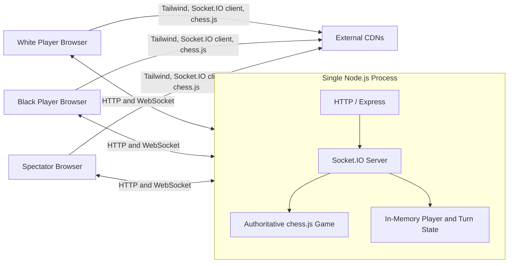
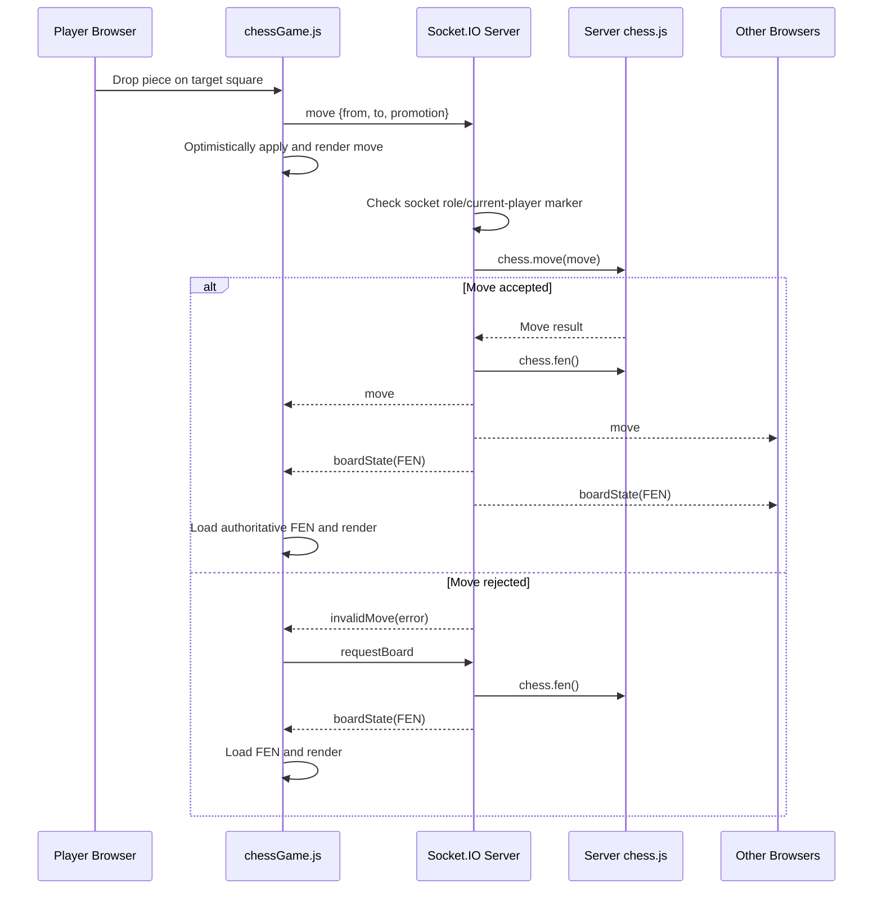

# Chess Application Architecture

This document describes the architecture of the current real-time multiplayer chess application. It contains:

- **High-Level Design (HLD):** the system's major components, responsibilities, communication paths, technology choices, and deployment model.
- **Low-Level Design (LLD):** the modules, functions, runtime state, event contracts, validation logic, and detailed request flows.

The design below documents the application as it is currently implemented. A final section calls out known limitations and possible future improvements.

## 1. System Overview

The application hosts one shared chess game. The first browser that connects becomes White, the second becomes Black, and later connections become spectators. Players move pieces by dragging and dropping them on the board.

The Node.js server owns the authoritative chess position. It uses Socket.IO to receive moves and publish updates, while `chess.js` validates chess rules and produces the position in FEN format. The browser keeps a local chess instance for immediate board rendering and reloads authoritative FEN updates from the server.

## 2. High-Level Design (HLD)

### 2.1 Goals

- Serve a browser-based chess board.
- Support two real-time players and additional spectators.
- Validate chess moves on the server.
- Synchronize accepted moves and board positions across connected clients.
- Recover a client from a rejected or out-of-sync move by sending the server's board state.

### 2.2 System Context



### 2.3 Major Components

| Component | Technology | Responsibility |
| --- | --- | --- |
| HTTP server | Node.js `http` | Hosts Express and Socket.IO on port `3000`. |
| Web application | Express.js | Serves the EJS page and static browser assets. |
| View template | EJS | Produces the initial HTML containing the chess-board container. |
| Real-time gateway | Socket.IO | Manages connections, roles, moves, errors, and board-state messages. |
| Game engine | Server-side `chess.js` | Stores the authoritative position, validates moves, tracks chess turns, and generates FEN. |
| Browser game client | JavaScript and client-side `chess.js` | Renders the board, handles drag-and-drop, submits moves, and applies server state. |
| Styling | CSS and Tailwind CSS CDN | Styles the page, board, squares, and pieces. |

### 2.4 Logical Layers

1. **Presentation layer**
   - `views/index.ejs` supplies the page structure and styles.
   - `public/js/chessGame.js` renders pieces and handles user interaction.

2. **Communication layer**
   - Express handles the initial HTTP request and static files.
   - Socket.IO carries bidirectional real-time events.

3. **Game/application layer**
   - Connection logic assigns White, Black, or spectator roles.
   - Move logic checks the socket's role and delegates rule validation to `chess.js`.

4. **State layer**
   - A server-side `Chess` instance stores the position.
   - Plain in-memory variables store player socket IDs and the current-player marker.
   - There is no persistent database or shared cache.

### 2.5 Primary Data Flow



### 2.6 Deployment Model

The current application is deployed as one Node.js process:

```text
Browser(s) -> Node.js HTTP server :3000 -> Express + Socket.IO + chess.js
```

Important deployment characteristics:

- The port is hardcoded to `3000`.
- One process contains one shared game.
- All game and player state is held in memory.
- Restarting the process resets the game and roles.
- Running multiple server instances would create separate game states unless a shared state store and a Socket.IO adapter were added.
- The browser requires internet access for the current CDN-hosted front-end libraries.

## 3. Low-Level Design (LLD)

### 3.1 Project Structure

```text
chess/
|-- app.js                   # HTTP server, Socket.IO handlers, and authoritative game
|-- package.json             # Scripts and runtime dependencies
|-- package-lock.json        # Locked dependency graph
|-- public/
|   `-- js/
|       `-- chessGame.js     # Browser board, drag-and-drop, and socket handlers
`-- views/
    `-- index.ejs            # HTML template and board styling
```

### 3.2 Server Module: `app.js`

#### Initialization

| Item | Purpose |
| --- | --- |
| `express()` | Creates the web application. |
| `http.createServer(app)` | Creates the HTTP server shared by Express and Socket.IO. |
| `socket(server)` | Attaches the Socket.IO server. |
| `new Chess()` | Creates the single authoritative chess game. |
| `app.set("view engine", "ejs")` | Enables EJS view rendering. |
| `express.static(...)` | Serves files from `public/`. |

#### Server State

| State | Type | Initial value | Meaning |
| --- | --- | --- | --- |
| `chess` | `Chess` | Starting chess position | Authoritative board, legal moves, and chess turn. |
| `players` | Object | `{}` | Maps `white` and `black` to Socket.IO connection IDs. |
| `currentPlayer` | String | `"W"` | Marker used by role checks before a submitted move is validated. |

Expected shape of `players`:

```js
{
  white: "socket-id-for-white",
  black: "socket-id-for-black"
}
```

#### HTTP Route

| Method | Path | Response |
| --- | --- | --- |
| `GET` | `/` | Renders `views/index.ejs` with page metadata. |

Template values currently include `title`, `appName`, and `items`. Only `title` is used by the template.

#### Connection and Role Assignment

When a new socket connects:

1. If `players.white` is empty, store the socket ID and emit `playerRole` with `"W"`.
2. Otherwise, if `players.black` is empty, store the socket ID and emit `playerRole` with `"B"`.
3. Otherwise, emit `spectatorRole` without a payload.

When a socket disconnects, its matching White or Black entry is deleted. The next connection can claim the available role. The chess position itself is not reset.

#### Move Handler

Input shape:

```js
{
  from: "e2",
  to: "e4",
  promotion: "q"
}
```

Processing steps:

1. Compare `currentPlayer` with the submitted socket's assigned role.
2. Reject an unauthorized socket with `invalidMove`.
3. Pass the move to `chess.move(move)` for chess-rule validation.
4. If accepted, update `currentPlayer` using `chess.turn()`.
5. Broadcast the move through `move`.
6. Broadcast the authoritative position through `boardState` as a FEN string.
7. If validation throws, return the error message through `invalidMove`.

#### Board Recovery Handler

When a client emits `requestBoard`, the server responds only to that socket with the current `chess.fen()` value through `boardState`.

### 3.3 Browser Module: `public/js/chessGame.js`

#### Browser State

| State | Type | Purpose |
| --- | --- | --- |
| `socket` | Socket.IO client | Real-time connection to the server. |
| `chess` | Client-side `Chess` | Local position used to build the visual board. |
| `boardElement` | DOM element | Container for the 64 generated squares. |
| `draggedPiece` | DOM element or `null` | Piece currently being dragged. |
| `sourceSquare` | `{row, col}` or `null` | Origin coordinates for the active drag. |
| `playerRole` | `"w"`, `"b"`, or `null` | Role received from the server. |

#### `pieceMap`

Maps chess.js piece types (`p`, `r`, `n`, `b`, `q`, and `k`) to Unicode chess symbols.

#### `getPieceUnicode(type)`

- Normalizes the piece type to lowercase.
- Returns the corresponding Unicode symbol.
- Returns an empty string for an unknown type.

#### `renderBoard()`

1. Reads the local 8x8 board with `chess.board()`.
2. Clears the current board DOM.
3. Creates 64 square elements and alternates `light`/`dark` classes.
4. Adds `dragover` and `drop` handlers to every square.
5. Creates draggable piece elements for occupied squares.
6. Converts matrix coordinates into algebraic notation:

   ```text
   file = character 97 + column (a-h)
   rank = 8 - row (8-1)
   ```

7. Sends all pawn promotions as queen promotions (`promotion: "q"`).
8. Optimistically applies a dropped move to the local chess instance and rerenders.

#### `handleMove(move)`

Attempts to apply a server-broadcast move to the local `Chess` instance and rerenders when successful. Any exception is written to the browser console.

#### Client Event Handlers

| Event | Client behavior |
| --- | --- |
| `move` | Calls `handleMove(move)`. |
| `boardState` | Loads the supplied FEN and rerenders the board. |
| `playerRole` | Converts `"W"`/`"B"` to `"w"`/`"b"` and stores it. |
| `invalidMove` | Logs the rejection and emits `requestBoard`. |

### 3.4 Socket.IO Event Contract

| Direction | Event | Payload | Purpose |
| --- | --- | --- | --- |
| Server -> client | `playerRole` | `"W"` or `"B"` | Assign a player color. |
| Server -> client | `spectatorRole` | None | Mark a connection as a spectator. |
| Client -> server | `move` | `{from, to, promotion}` | Submit a requested move. |
| Server -> all | `move` | `{from, to, promotion}` | Notify every client of an accepted move. |
| Server -> all | `boardState` | FEN string | Publish the authoritative position after a move. |
| Client -> server | `requestBoard` | None | Ask for the authoritative position. |
| Server -> requesting client | `boardState` | FEN string | Resynchronize one client. |
| Server -> client | `invalidMove` | Error string or rejected move | Report a rejected move. |

### 3.5 Detailed Runtime Flows

#### Application startup

1. Create Express and the HTTP server.
2. Attach Socket.IO.
3. Create a new chess game at the standard starting position.
4. Configure EJS and static files.
5. Register HTTP and socket handlers.
6. Listen on port `3000`.

#### Page load

1. Browser requests `GET /`.
2. Express renders `index.ejs`.
3. Browser downloads CDN scripts and `/js/ChessGame.js`.
4. Client creates its local chess instance and renders the initial position.
5. Socket.IO connects and receives a player or spectator role.

#### Accepted move

1. User drags a piece and drops it on a square.
2. Client builds algebraic `from` and `to` coordinates.
3. Client emits `move` and optimistically updates its local board.
4. Server performs role and chess-rule checks.
5. Server broadcasts both the move and authoritative FEN.
6. Every client loads the FEN and rerenders in sync.

#### Rejected move

1. Server emits `invalidMove` to the submitting socket.
2. Client requests the authoritative board.
3. Server returns its current FEN to that client.
4. Client replaces its local state and rerenders.

## 4. Current Design Limitations and Risks

These points describe the existing implementation and are useful inputs for future design work:

1. **Only one game exists.** Every connected browser shares the same `Chess` instance.
2. **State is not persistent.** A server restart loses the board and player assignments.
3. **Horizontal scaling is unsupported.** Multiple Node.js instances would not share game or socket state.
4. **The current-player marker changes case.** It starts as uppercase `"W"`, while `chess.turn()` returns lowercase `"w"` or `"b"`. After the first accepted move, the uppercase authorization comparisons no longer match, so role enforcement can be bypassed even though chess.js still validates chess turns.
5. **The client role is not used to restrict interaction.** `playerRole` is stored but does not disable opponent pieces, block spectators, or rotate Black's board.
6. **A newly joined client is not proactively synchronized.** The server does not automatically send the current FEN on connection, and the client does not initially emit `requestBoard`. A late joiner can therefore display the starting position until another update occurs.
7. **The submitting client applies an accepted move twice.** It performs an optimistic move and then receives the broadcast `move`; the subsequent `boardState` corrects the client, but the duplicate attempt can produce console errors.
8. **No game-over workflow exists.** Checkmate, stalemate, draw, resignation, rematch, and reset states are not presented to users.
9. **Promotion is queen-only.** The UI does not allow rook, bishop, or knight selection.
10. **Spectator role has no client handler.** The event is emitted but does not change the UI or interaction behavior.
11. **Error payloads are inconsistent.** `invalidMove` may contain a string or a move object.
12. **No automated tests are configured.** The current `npm test` script intentionally exits with an error.
13. **Port configuration is fixed.** The server does not read `process.env.PORT`, which some hosting platforms require.
14. **Front-end libraries depend on CDNs.** Offline use and strict Content Security Policy deployments are not supported by the current page.
15. **The client script path has a case mismatch.** The template requests `/js/ChessGame.js`, while the tracked file is `public/js/chessGame.js`. This works on a case-insensitive Windows filesystem but can return `404` on Linux and other case-sensitive hosts.
16. **The chess.js versions differ across tiers.** The server installs `chess.js` `^1.4.0`, while the browser loads `0.10.3` from a CDN, which increases the chance of inconsistent API or rule behavior.
17. **The direct `ws` dependency is unused by application code.** Socket.IO manages its own transport dependencies, so the top-level package is not currently referenced.

## 5. Recommended Future Architecture

For a production-ready multi-game service, evolve the design in stages:

- Introduce a `GameSession` model keyed by a generated game ID.
- Keep role and turn values in one lowercase representation.
- Treat the server as fully authoritative: send FEN on connection and use one accepted-state event rather than applying the same move twice.
- Validate that a socket owns the moving color on every move.
- Add room-based Socket.IO broadcasts so games are isolated.
- Add explicit create, join, leave, reset, and game-over commands.
- Persist game metadata and moves in a database.
- Use Redis or another shared adapter for Socket.IO and transient state when running multiple instances.
- Add authentication, reconnect tokens, rate limits, schema validation, structured errors, logging, and automated tests.
- Read deployment settings such as the port and allowed origins from environment variables.

A possible future component layout would be:

```text
Routes / Socket Gateway
        |
        v
Game Session Service ---- Player/Authorization Service
        |
        +---- chess.js rules engine
        +---- Persistent game repository
        +---- Shared real-time state / Socket.IO adapter
```
